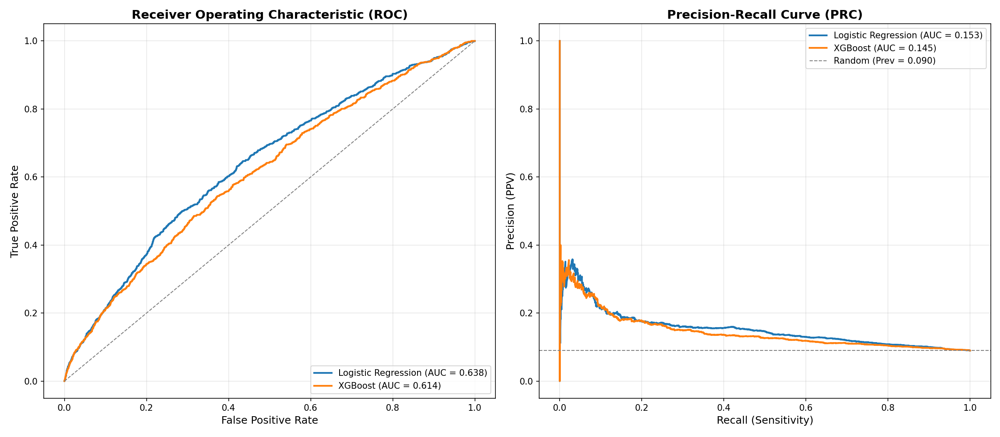

# Patient Readmission Prediction System

**One-Line Project Name:** Smart Diabetic Patient Readmission Risk Prediction System

**One-Line Problem Statement:** Hospitals face difficulty in identifying diabetic patients who are at high risk of 30-day readmission before discharge.

## OUTLINE

### Problem Statement
Hospital readmission within 30 days is a major healthcare challenge because it reflects possible gaps in treatment continuity, increases patient risk, and adds pressure on hospital resources. For diabetic patients, repeated admissions are especially common due to chronic disease complexity, comorbid conditions, medication burden, and varying discharge outcomes. The main problem addressed in this project is the difficulty of identifying high-risk diabetic patients before discharge using available hospital encounter data. This section focuses only on the problem: hospitals need a reliable way to understand which patients are more likely to be readmitted within 30 days so that care teams can plan follow-up and intervention more effectively.

### Proposed System/Solution
The proposed system is a machine learning based patient readmission prediction pipeline built on structured hospital encounter data from diabetic patients. The system preprocesses raw clinical data, engineers informative features, trains predictive models, evaluates their performance, and exposes predictions through a Streamlit dashboard. Logistic Regression is used as an interpretable baseline, while XGBoost is used as the primary non-linear model. The system also includes explainability using SHAP and subgroup auditing across demographic categories so that predictions can be inspected instead of treated as black-box outputs.

### System Development Approach (Technology Used)
The project is developed in Python as an end-to-end machine learning workflow. The main technologies used are:

- `Python` for the complete implementation.
- `pandas` and `numpy` for data loading, cleaning, and transformation.
- `scikit-learn` for preprocessing pipelines, train/validation/test splitting, Logistic Regression, and evaluation metrics.
- `imbalanced-learn` with `SMOTENC` to handle class imbalance for the tree-based model.
- `XGBoost` for the main prediction model.
- `Optuna` for hyperparameter optimization.
- `MLflow` for experiment tracking and model logging.
- `SHAP` for explainability and feature impact analysis.
- `Matplotlib` and `Seaborn` for visualizations.
- `Streamlit` for the interactive dashboard.

The repository follows a modular structure with separate folders for data processing, feature engineering, modeling, evaluation, and dashboard components.

### Algorithm & Deployment
The working flow of the system is:

1. Load the diabetic readmission dataset.
2. Clean the data by replacing invalid markers, removing sparse columns, removing leakage-prone discharge cases, and keeping one encounter per patient.
3. Convert the target into binary form: readmitted within 30 days or not.
4. Engineer domain-relevant features such as age midpoint, prior utilization, medication burden, insulin intensity, grouped diagnoses, discharge category, admission category, and Elixhauser comorbidity score.
5. Split the dataset into train, validation, and test sets using stratified sampling.
6. Build preprocessing pipelines:
   - Logistic Regression uses scaling and one-hot encoding.
   - XGBoost uses passthrough numeric features and ordinal encoding for categorical features.
7. Apply `SMOTENC` on the XGBoost training set to reduce class imbalance.
8. Train the baseline Logistic Regression model.
9. Train and tune the XGBoost model using Optuna.
10. Evaluate the models using AUROC, AUPRC, F1-score, Brier score, sensitivity, specificity, PPV, and NPV.
11. Generate plots such as ROC/PR curves, calibration curve, confusion matrix, SHAP plots, and fairness audit outputs.
12. Deploy the trained model through a Streamlit dashboard for held-out patient exploration and manual patient intake scoring.

Deployment in this project is lightweight and local: trained models are saved as `.joblib` files in `models/`, evaluation artifacts are stored in `reports/`, and the final interface runs through `dashboard/app.py` using Streamlit.

### Result (Output Image)
The project successfully produces a complete prediction workflow and stores model artifacts, evaluation metrics, and visual outputs. Based on the generated `reports/metrics/model_comparison.csv`, the saved test results show:

- Logistic Regression: `AUROC = 0.6379`, `AUPRC = 0.1533`
- XGBoost (Tuned): `AUROC = 0.6269`, `AUPRC = 0.1425`

Although the predictive performance is modest, the repository demonstrates a full healthcare ML system with preprocessing, modeling, interpretation, fairness auditing, and dashboard-based inference.

Example output image:

### Conclusion
This project demonstrates that structured hospital encounter data can be used to estimate 30-day readmission risk for diabetic patients through an end-to-end machine learning pipeline. It goes beyond basic model training by including cleaning steps to reduce leakage, clinically meaningful feature engineering, explainability with SHAP, subgroup auditing, and an interactive dashboard for demonstration. The final system is suitable as a healthcare analytics capstone or internship project because it covers the full workflow from raw data to usable prediction output.

### Future Scope
- Improve predictive performance with stronger feature selection and model calibration.
- Validate the system on external hospital datasets to measure generalizability.
- Use temporal or longitudinal patient history rather than a single encounter view.
- Add deep learning or sequence models for richer EHR trajectories.
- Include clinical notes or discharge summaries using NLP methods.
- Expand fairness analysis with better threshold selection and subgroup calibration review.
- Deploy the dashboard with database-backed storage, authentication, and real-time clinical integration.

### References
1. Kaggle / UCI diabetic readmission dataset: `diabetes+130-us+hospitals+for+years+1999-2008`
2. Repository documentation: `README.md`
3. Source modules used in this project:
   - `src/data/cleaner.py`
   - `src/data/splitter.py`
   - `src/features/engineer.py`
   - `src/features/pipeline.py`
   - `src/models/baseline.py`
   - `src/models/xgboost_model.py`
   - `src/models/trainer.py`
   - `src/evaluation/metrics.py`
4. Generated project artifacts:
   - `reports/metrics/model_comparison.csv`
   - `reports/metrics/fairness_audit.csv`
   - `reports/figures/roc_prc_comparison.png`
   - `reports/figures/xgboost_confusion_matrix.png`

## TEMPLATE FILL

**PROBLEM STATEMENT:**  
Predicting whether a diabetic patient will be readmitted within 30 days is difficult because hospitals must make discharge decisions using complex, noisy, and imbalanced clinical data. A poor estimate of readmission risk can lead to inadequate follow-up planning, avoidable hospital burden, and weaker patient outcomes.

**PROPOSED SOLUTION:**  
Build an end-to-end machine learning system that uses structured hospital encounter data to classify diabetic patients into readmission risk categories. The solution includes preprocessing, feature engineering, Logistic Regression and XGBoost models, SHAP explainability, fairness auditing, and a Streamlit dashboard for interactive prediction.

**SYSTEM APPROACH:**  
The system is developed in Python using pandas, numpy, scikit-learn, imbalanced-learn, XGBoost, Optuna, MLflow, SHAP, Matplotlib, Seaborn, and Streamlit. It follows a modular pipeline covering data loading, cleaning, feature engineering, training, evaluation, and dashboard deployment.

**ALGORITHM & DEPLOYMENT:**  
The project cleans the diabetic dataset, creates engineered features such as utilization counts, medication burden, grouped diagnoses, and comorbidity score, then splits data into train/validation/test sets. Logistic Regression is trained as a baseline, and XGBoost is trained as the main model with Optuna tuning and SMOTENC oversampling. The trained models are saved as `.joblib` files and deployed locally through a Streamlit dashboard.

**RESULT:**  
The project generated evaluation outputs and visual reports. On the saved test results, Logistic Regression achieved AUROC 0.6379 and AUPRC 0.1533, while tuned XGBoost achieved AUROC 0.6269 and AUPRC 0.1425. The repository also includes ROC/PR plots, calibration curves, confusion matrix outputs, SHAP explanations, and fairness audit tables.

**CONCLUSION:**  
The system shows that hospital encounter data can support early identification of diabetic patients at risk of 30-day readmission. Even with moderate predictive scores, the project provides a complete, interpretable, and deployment-ready machine learning workflow for healthcare decision support demonstrations.

**FUTURE SCOPE:**  
Future work can improve performance through external validation, better calibration, temporal modeling, NLP on clinical notes, deeper fairness analysis, and production-grade deployment with secure integration into hospital systems.

**REFERENCES:**  
Dataset: `dataset_diabetes/diabetic_data.csv` and `dataset_diabetes/IDs_mapping.csv`  
Documentation: `README.md`  
Metrics: `reports/metrics/model_comparison.csv`, `reports/metrics/fairness_audit.csv`  
Code: `src/` modules and `dashboard/app.py`
